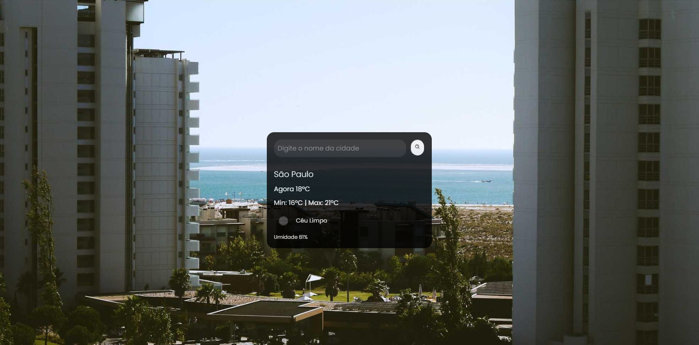

# 🌦️ Previsão do Tempo

Projeto desenvolvido com HTML, CSS e JavaScript para consultar a **previsão do tempo em tempo real** usando a API da OpenWeatherMap.

## 🔥 Funcionalidades

- Consulta de tempo atual em qualquer cidade do mundo;
- Exibição de:
  - Temperatura atual;
  - Temperatura mínima e máxima;
  - Umidade;
  - Condição do tempo (nublado, limpo, etc);
- Ícone de clima dinâmico conforme a condição;
- Busca ao clicar no botão ou pressionar "Enter";
- Tratamento de erros para cidades inválidas ou falha de conexão.

## ✨ Tecnologias Utilizadas

- HTML5
- CSS3
- JavaScript (vanilla)
- OpenWeatherMap API
- Boxicons
- Google Fonts

## 📚 Atualizações recentes

- ✅ Adição da temperatura **mínima e máxima**;
- ✅ Implementado **tratamento de erros** com `try/catch` e validação de resposta da API;
- ✅ Input ativado via tecla "Enter".

## 👨‍🏫 Mentoria

Projeto desenvolvido com a **mentoria do Rodolfo Mori**, durante o processo de aprendizagem em projetos web.

---

## 📷 Captura de tela 


## Pesquisando " São paulo "


---

## 🚀 Como usar

1. Clone o repositório:
```bash
git clone https://github.com/seu-usuario/previsao-do-tempo.git
